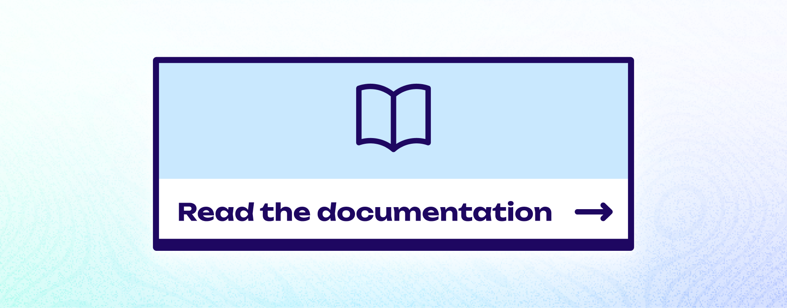

- [LoopGate](https://loopgate.netlify.app/) is a web app that allows creators to token-gate content based on Loopring Layer-2 NFTs.
- It uses the [Loopring API](https://docs.loopring.io/en/) alongside the [Piñata Submarine API](https://docs.pinata.cloud/submarine-api) to unlock hidden content hosted on IPFS.

 

 

# How to use LoopGate

- You can run your own version of LoopGate by [following the tutorial in the documentation](https://0xgeel.gitbook.io/loopgate-documentation/).

# Contributing

Got ideas for this project?

- Feel free to add feature requests or report issues: https://github.com/0xGeel/loopgate/issues.
- Please read the [contributing docs](https://github.com/0xGeel/loopgate/blob/master/.github/CONTRIBUTING.md) **before submitting a pull request**.

# License

- **BSD-2-Clause License**

See [LICENSE](/LICENSE) for more information.

---

## Current status

This project is **in active development** 🚀.

- ✅ The foundation is in place:
  - ✅ Integrating a `web3 provider` to allow users to connect with their wallet (`WalletConnect`, `GameStop/Metamask/Injected`).
  - ✅ Accessing the `Loopring API` to retrieve the connected user's held NFTs.
  - ✅ Accessing the `Pinata Submarine API` to unlock submarined files based on the admin-specified `config.ts`.

**Next steps may include**

- ✅ ~~Auth, client-side & server-side sessions.~~
- ✅ ~~Documentation for others on how to use this.~~
- Individual pages for unlockables.
- Requiring user's Loopring signature to use Loopring API.
- ⏳ Completing coverage for unit/integration tests for core services/functionalities
