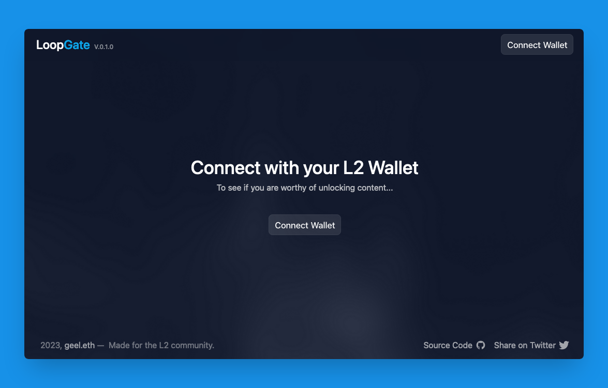

 

# Getting Started

Run `npm run dev` in your terminal, and then open [localhost:3000](http://localhost:3000) in your browser.

Once the webpage has loaded, changes made to files inside the `src/` directory (e.g. `src/pages/index.tsx`) will automatically update the webpage.

# Learn more

To learn more about [Next.js](https://nextjs.org), [ConnectKit](https://docs.family.co/connectkit) or [wagmi](https://wagmi.sh), check out the following resources:

- [wagmi Documentation](https://wagmi.sh) – learn about wagmi Hooks and API.
- [wagmi Examples](https://wagmi.sh/examples/connect-wallet) – a suite of simple examples using wagmi.
- [ConnectKit Documentation](https://docs.family.co/connectkit) – learn more about ConnectKit (configuration, theming, advanced usage, etc).
- [Next.js Documentation](https://nextjs.org/docs) learn about Next.js features and API.
- [Learn Next.js](https://nextjs.org/learn) - an interactive Next.js tutorial.
