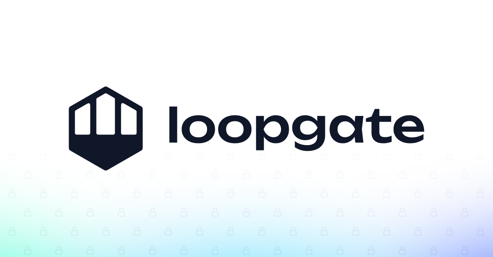
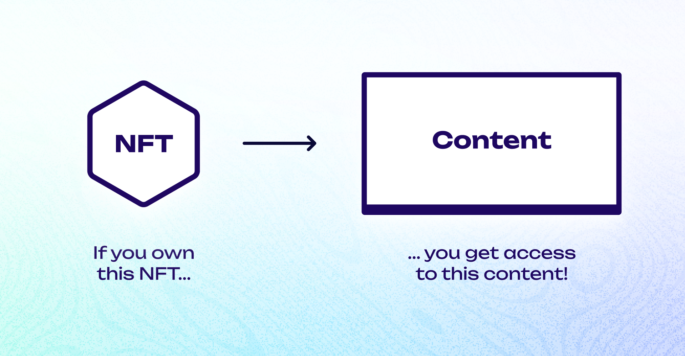

# Introduction

LoopGate is a web app that allows creators to **token-gate content** based on Loopring Layer-2 NFTs. It uses the Loopring API alongside the Piñata Submarine API to unlock hidden content hosted on IPFS.


The software is developed by [0xGeel](https://twitter.com/0xGeel), and is Open Source under the BSD-2-Clause license. To view the source code, see the [GitHub repository](https://github.com/0xGeel/loopgate).


---

## Who is LoopGate for?

### L2 Creators 🧑🏻‍🎨

- Creators can use LoopGate to provide benefits to their community. It can be used to configure unique content that only holders of specific L2 NFTs should have access to. This is known as **'token-gating'**.
- Examples of token-gated content could be **Blog Posts**, **Videos** , **Downloadable (3D) Assets**, and even **(Web) Games**. Your imagination is the limit!

### Collectors 🙋

- Collectors can visit the LoopGate website to access token-gated content. They can connect their crypto wallet to the website to verify their ownership.
- If their wallet contains NFTs that should unlock content, LoopGate will display links to that content, allowing access.

## Run your own instance of LoopGate

Keep reading to learn how LoopGate works, and how you can host your own instance!

- [Setting up your own LoopGate](setup/OVERVIEW.md)
  - [Technical overview](setup/OVERVIEW.md)
  - [Some other child page](part1/page1-2.md)
