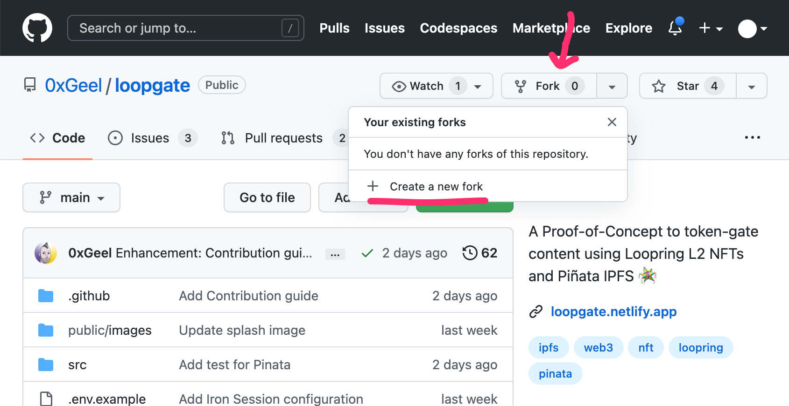
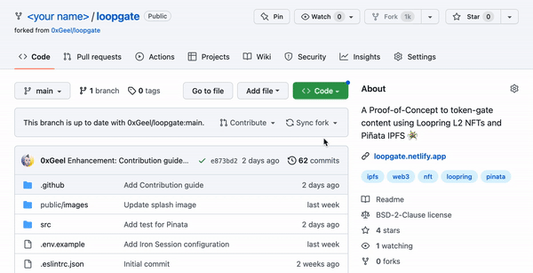
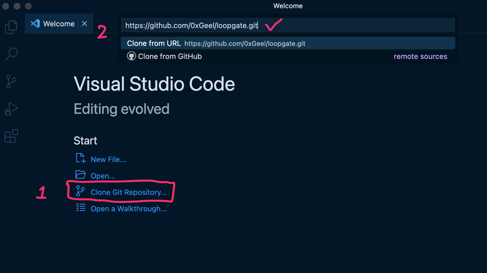
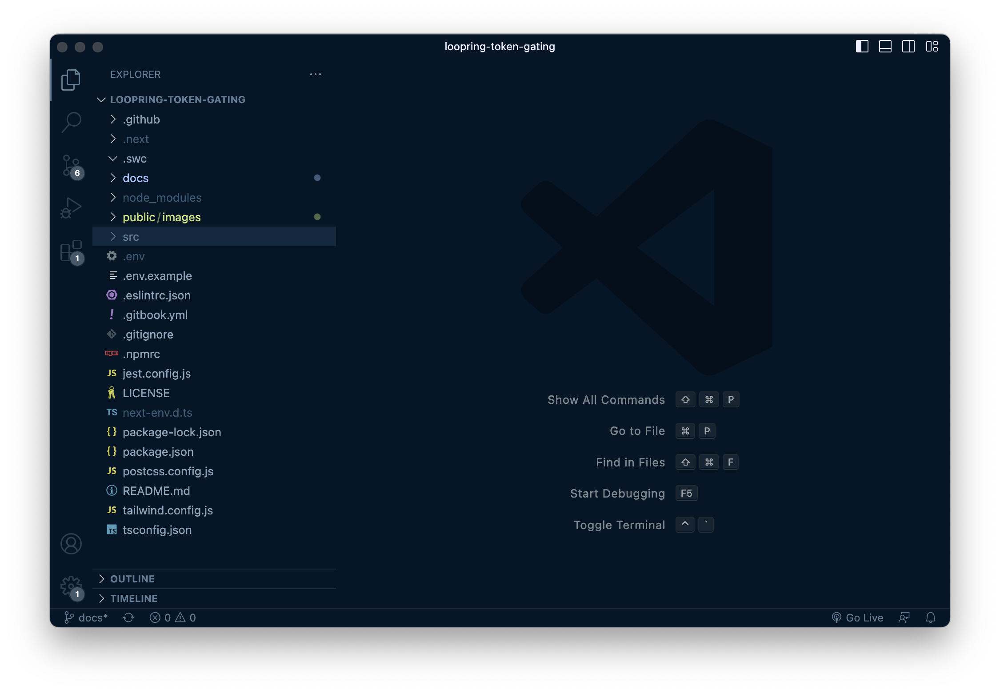

# 1. Forking the project

> **TL;DR:** In this step you make a copy of the code on your computer. This is called 'Forking'.

1. Log in with your Github account on https://github.com.
2. Go to [LoopGate's GitHub page](https://github.com/0xGeel/loopgate) and click on **'Fork'** > **'Create a new fork'**. This will create a copy of the project that you can edit.

3. Click on the green 'Code' button in your forked repository, then copy the HTTPS link.

4. Open your preferred code editor ([I recommend VS Code](https://code.visualstudio.com/)).
5. In the start menu, click on **Clone Git Repository** and paste the link you just copied.

6. Select where you'd like to save your project, and open the project. (I like to keep my files in _/desktop/dev/_).

**Congrats, you now have set up your own copy of the LoopGate web app on your own computer!**

It should look a little like this:

