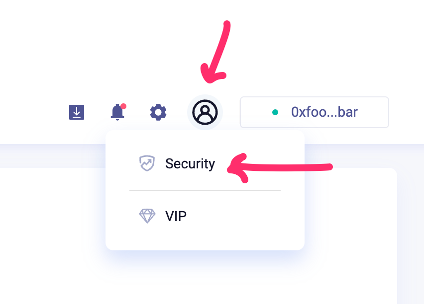

# 2. Gathering your secrets

You need to provide a couple of secrets (passwords / API Keys) to make your own application works.

Commonly, these are stored in a `.env` file at the root of the project.

- Make a copy of the `.env.example` file, and name it `.env`. Open it in your code editor. This is where you'll be storing your secrets.
- Please note: the `.env` file should NEVER be shared with others or checked in to any Git repository. The git tracking for this project is set to not share the `.env` file.
- However, if you do accidentally share your `.env`, be sure to change void any API keys that you might have leaked, and update them.

## Loopring


The Loopring API key is used to check data on the Loopring blockchain.


- Go to the Loopring.io website, and connect an activated L2 wallet. I recommend creating a new wallet for this, since they are cheap anyways.
- Once you've logged in and unlocked your account, navigate to the 'Security' tab.

- Click on 'Export Account'. Look for the `"apiKey": "..."`, and copy the key. Paste it in your `.env` file so that `LOOPRING_API_KEY=YOUR_API_KEY`.

## Pinata


The Pinata Submarine API key is used to unlock the hidden files.


- Log in to https://app.pinata.cloud.
- Click on the 'Gateway' tab. Click on 'Create Gateway' to create your own gateway. Name it however you like. Copy the full name, and paste it in your `.env` file so that `NEXT_PUBLIC_PINATA_GATEWAY_URL=NAME.mypinata.cloud`.

- Next, click on the 'Developers' tab, then the 'Submarine keys' tab.
- Click on '+ New Key' to generate a new key. Copy it, and paste it in your `.env` file so that `PINATA_SUBMARINE_KEY=YOUR_SUB_KEY`.

## Session Secret


The 'session secret' is used to secure the authorization cookies.


- Finally, you need to generate a password which will secure the sessions/cookies in your web app. It does not really matter what this password is, but for security purposes, make it at least 32 characters long.
- You could use https://passwordsgenerator.net/ to generate a 32+ char password.
- Copy it, and paste it in your `.env` file so that `SESSION_SECRET=YOUR_PASSWORD`

Congrats, that is all the secrets you'll need to run this project.


We'll check the validity of the `.env` file in Step 4. I'll remind you by then!

