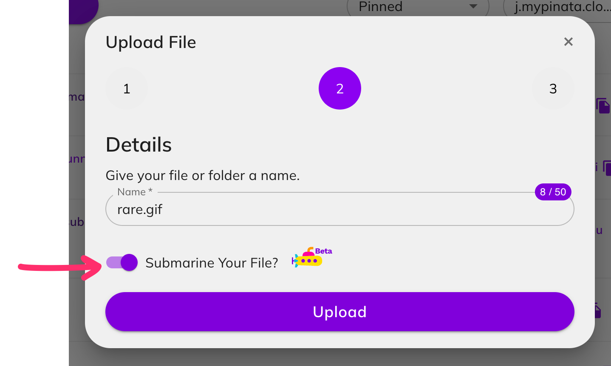
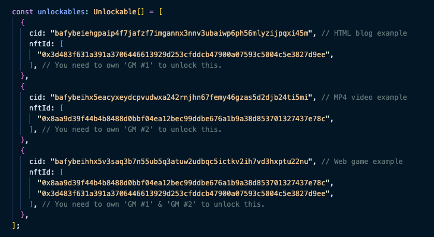
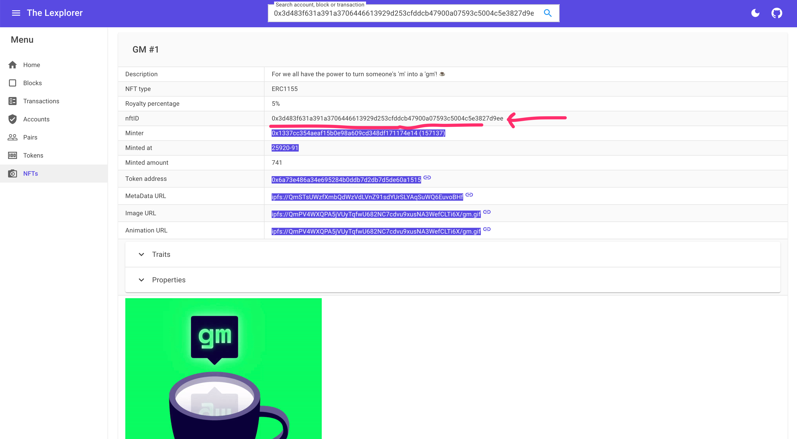

# 3. Uploading files to Piñata

1. Go to [https://app.pinata.cloud/pinmanager](https://app.pinata.cloud/pinmanager).
2. Click on 'Upload' and select the **file** or **folder** you'd like to submarine.
3. Click the checkbox: **'Submarine Your File'**.

4. Copy the `CID`. It should start with `baf...`.
5. Open the `config/config.ts` file and paste your CID into one of the `unlockable` items.
6. Look up any of the NFTs you have minted on Loopring L2, and copy its `NFT ID`. Paste it into the `nftId: [""]` array.

