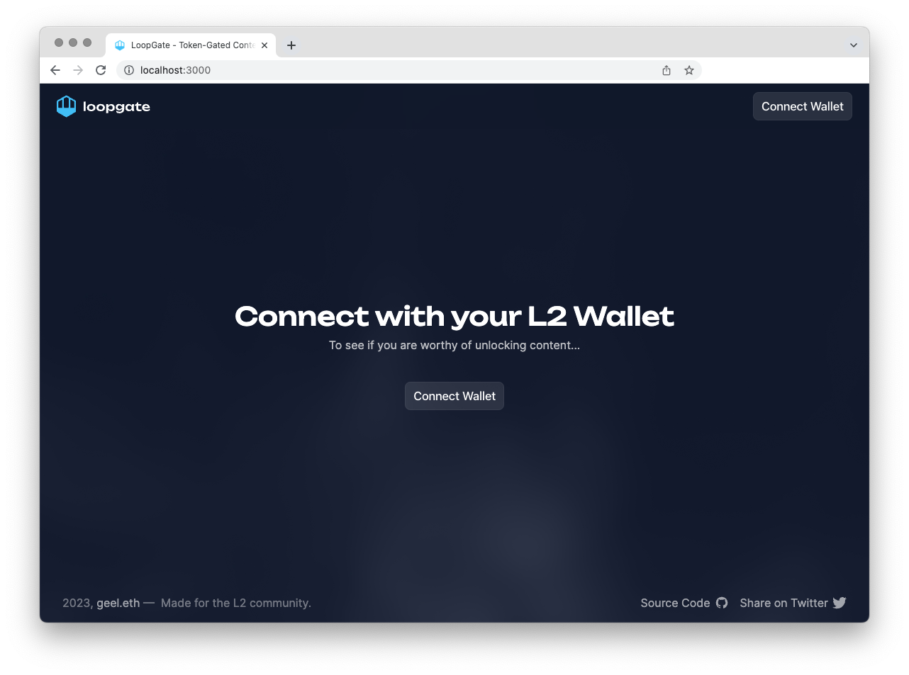
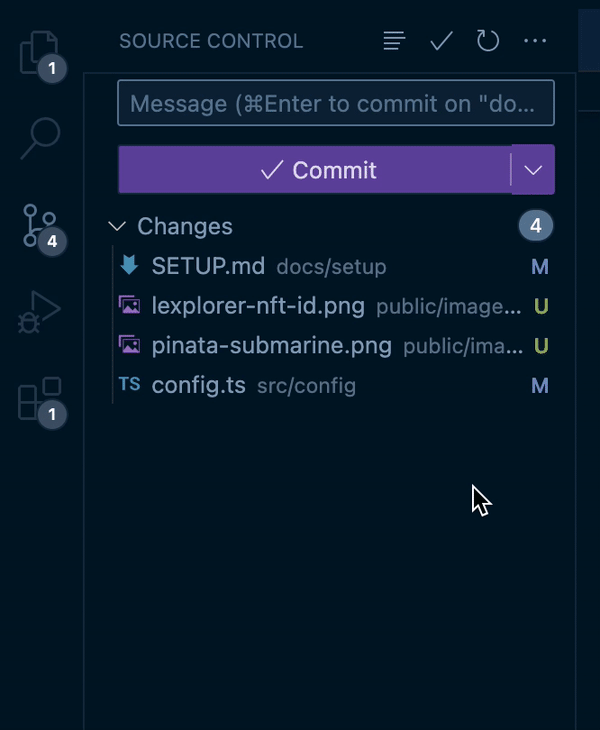

# 4. Running your site locally

1. Open the terminal in your code editor.
2. Type `npm install`, and hit enter.
3. Type `npm run dev`, and hit enter.

Your app should now be running locally on your computer! 🚀&#x20;

You can access it by opening a browser and going to the following URL: \
[http://localhost:3000](http://localhost:3000)

### **Verify your .env :**

Now your LoopGate is running on your local machine, it's time to check the `.env` file.

- Go to the following url: [http://localhost:3000/api/env-status](http://localhost:3000/api/env-status).

This checks the secrets in your `.env` file: if these are misconfigured, LoopGate will not work.

---

### **Publishing your changes:**

If you've made changes to the config, you'll probably want your users to see this too.

Follow these steps to update your code in GitHub:

1. Check the files you'd like to update and 'stage' them.
2. 'Commit' them by inputting a concise message of what you updated.
3. 'Push' them to your GitHub repository by clicking 'Push'.


Confused as to how GitHub works? Check out their excellent tutorial: [https://docs.github.com/en/get-started/quickstart/hello-world](https://docs.github.com/en/get-started/quickstart/hello-world)

