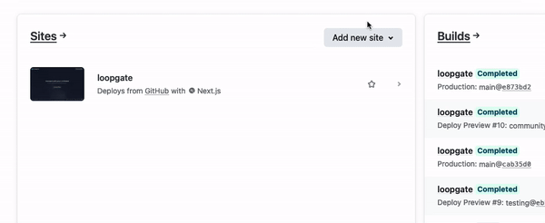
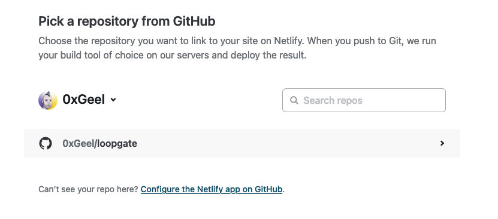

# 5. Deploying your site

### **1. Set up**

1. Log in to Netlify: https://app.netlify.com/
2. Click on 'Add new site' > 'Import an existing project'.
3. Connect to your Git Provider: `GitHub`.

4. Pick your repository: `<YOUR_NAME>/loopgate`.
5. Click on 'Deploy site'.

---

### **2. Configure**

Congratulations, any changes you push to the `main` branch on your GitHub repository will be sent to Netlify!

However, there is still one important step: adding the environment secrets to Netlify. Here's how you do that:

1. Go to your project's the 'env' settings of your project's Netlify page: [https://app.netlify.com/sites/YOUR_PROJECT_NAME/settings/env](https://app.netlify.com/sites/YOUR_PROJECT_NAME/settings/env)
2. Click on 'Add a variable', then 'import from a .env file'.
3. Copy the contents of your `.env` file, and paste them in the input field. Click on 'Import variables'.
4. Once more, check the `/api/env-status` endpoint to see if all secrets are defined. Your site should be live soon at [https://YOUR_PROJECT_NAME.netlify.app/api/env-status](https://YOUR_PROJECT_NAME.netlify.app/api/env-status)


Your Netlify website will most likely have an auto-generated name like '[https://adjective-noun-12345.netlify.app](https://adjective-noun-12345.netlify.app)'. You can easily change the domain name in Netlify!


---

Good luck, and have fun Token-Gating with LoopGate!
