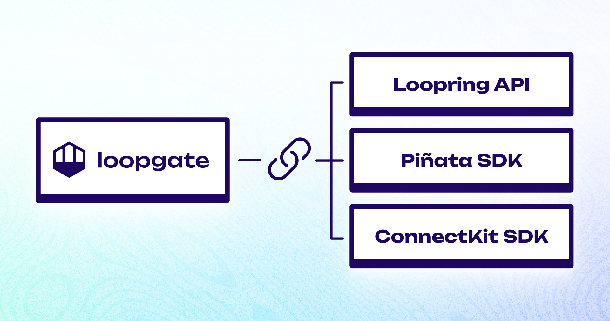

# Technical Overview

- LoopGate is a web application built using in **TypeScript** using [NextJS](https://nextjs.org/) and [TailwindCSS](https://tailwindcss.com/).
- LoopGate implements external **SDKs/APIs**. Most importantly:
  - [Loopring API](https://docs.loopring.io/en/) — Query the Loopring blockchain to get NFT ownership data.
  - [Piñata API](https://docs.pinata.cloud/pinata-submarine-api) — Query and unlock submarined content on Piñata.
  - [ConnectKit](https://github.com/family/connectkit) — Provides a seamless user experience for connecting crypto wallets.
- LoopGate can **easily be deployed online** from its GitHub repository using [Netlify](https://netlify.app/).
- You can edit the `src/config/config.ts` file to specify **new unlockables.**

##

## Requirements

In order to create your own instance of LoopGate, you will need the following:

### **Tools: 🛠️**

- [ ] **Node JS** installed on your computer. [(Guide)](https://nodejs.org/en/)
- [ ] **Git** installed on your computer. [(Guide)](https://github.com/git-guides/install-git)
- [ ] **A code editor**. [(I recommend VS Code)](https://code.visualstudio.com/)

### **Accounts: 🔑**

- [ ] A [**GitHub**](https://github.com/) account. (free)
- [ ] An activated **Loopring L2 account**. ([GME Wallet](https://wallet.gamestop.com/) / [Loopring Wallet](https://loopring.io/#/wallet))
- [ ] A [**Piñata 'Picnic'**](https://www.pinata.cloud/pricing) account.
- [ ] A [**WalletConnect Project ID**](https://docs.walletconnect.com/2.0/web/sign/installation).


Once you meet all of the requirements above, [proceed to setting up](../../1-FORKING.md)!

