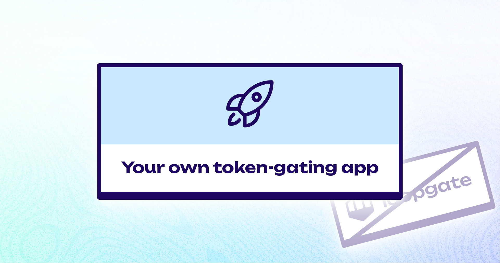

# 🔒 Setting up your own LoopGate

<figure><figcaption></figcaption></figure>

Depending on your experience with programming web applications, this guide will take \~30 minutes to two hours to complete.&#x20;

