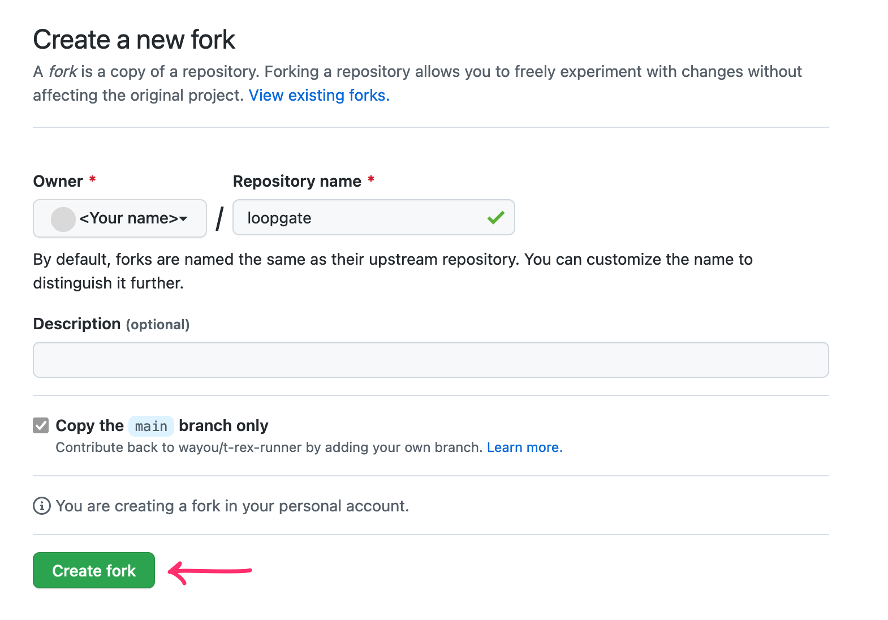
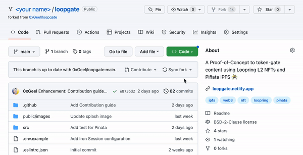

# Setting up

## Overview:

A summary of the steps required:

1. [Forking the project](#1-forking-the-project).
2. [Gathering your secrets](#2-gathering-your-secrets).
3. Uploading files to Piñata.
4. Deploying your site.

---

## 1. Forking the project

1. Log in with your Github account.
2. Go to [LoopGate's GitHub page](https://github.com/0xGeel/loopgate) and click on **'Fork'** > **'Create a new fork'**. This will create a copy of the project that you can edit.

3. Click on the green 'Code' button in your forked repository, then copy the HTTPS link.

4. Open your preferred code editor ([I recommend VS Code](https://code.visualstudio.com/)).
5. In the start menu, click on **Clone Git Repository** and paste the link you just copied.
6. Select where you'd like to save your project, and open the project. (I like to keep my files in _/desktop/dev/_).

**Congrats, you now have set up your own copy of the web app on your own computer!**

It should look a little like this:

---

## 2. Gathering your secrets

You need to provide a couple of secrets (passwords / API Keys) to make your own application works. Commonly, these are stored in a `.env` file at the root of the project.

- Make a copy of the `.env.example` file, and name it `.env`. Open it in your code editor. This is where you'll be storing your secrets.

### Loopring

- Go to the Loopring.io website, and connect an activated L2 wallet. I recommend creating a new wallet for this, since they are cheap anyways.
- Once you've logged in and unlocked your account, navigate to the 'Security' tab.

- Click on 'Export Account'. Look for the `"apiKey": "..."`, and copy the key. Paste it in your `.env` file so that `LOOPRING_API_KEY=<YOUR_API_KEY>`.

### Pinata

- Log in to https://app.pinata.cloud.

- Click on the 'Gateway' tab. Click on 'Create Gateway' to create your own gateway. Name it however you like. Copy the full name, and paste it in your `.env` file so that `NEXT_PUBLIC_PINATA_GATEWAY_URL=<NAME>.mypinata.cloud`.

- Next, click on the 'Developers' tab, then the 'Submarine keys' tab.
- Click on '+ New Key' to generate a new key. Copy it, and paste it in your `.env` file so that `PINATA_SUBMARINE_KEY=<YOUR_SUB_KEY>`.

### Session Secret

- Finally, you need to generate a password which will secure the sessions/cookies in your web app. It does not really matter what this password is, but for security purposes, make it at least 32 characters long.
- You could use https://passwordsgenerator.net/ to generate a 32+ char password.
- Copy it, and paste it in your `.env` file so that `SESSION_SECRET=<YOUR_PASSWORD>`

Congrats, that is all the secrets you'll need to run this project!
