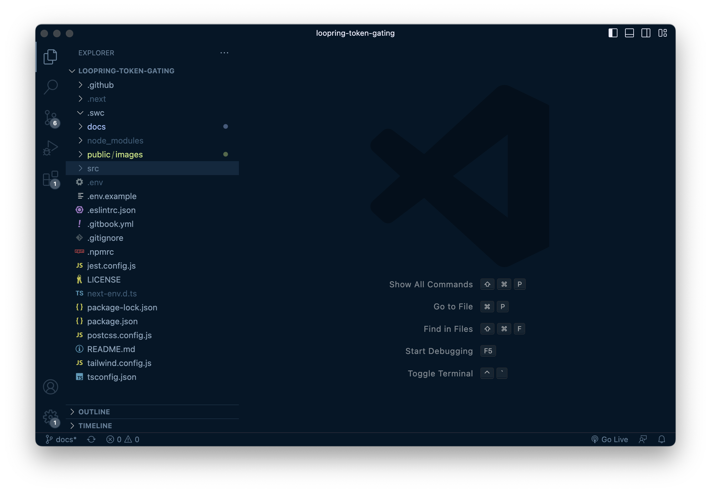

# Setting up

## Overview:

A summary of the steps required:

1. [Forking the project](#1-forking-the-project).
2. [Gathering your secrets](#2-gathering-your-secrets).
3. Uploading files to Piñata.
4. Deploying your site.

---

## 1. Forking the project

1. Log in with your Github account.
2. Go to [LoopGate's GitHub page](https://github.com/0xGeel/loopgate) and click on **'Fork'** > **'Create a new fork'**. This will create a copy of the project that you can edit.

3. Click on the green 'Code' button in your forked repository, then copy the HTTPS link.

4. Open your preferred code editor ([I recommend VS Code](https://code.visualstudio.com/)).
5. In the start menu, click on **Clone Git Repository** and paste the link you just copied.
6. Select where you'd like to save your project, and open the project. (I like to keep my files in _/desktop/dev/_).

**Congrats, you now have set up your own copy of the web app on your own computer!**

It should look a little like this:

---

## 2. Gathering your secrets

### 2.1 Loopring
